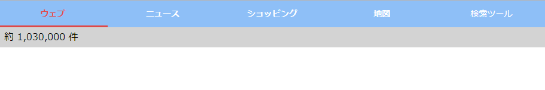
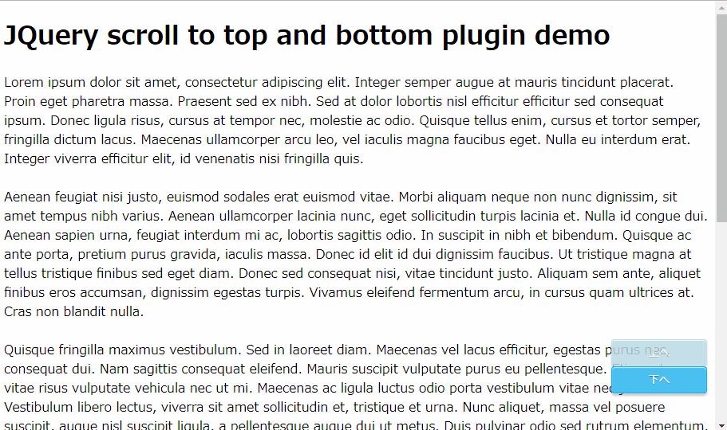

# 動作確認環境

- Chrome（バージョン: 74.0.3729.157）
- Edge（バージョン：42.17134.1.0）
- IE11（バージョン：11.765.17134.0）

# 操作説明

## switch_menu.html

### 要素

- タブ要素
  - 「ウェブ」「ニュース」「ショッピング」「地図」
- ボタン要素
  - 「 検索ツール」

### 操作

- 「ウェブ」「ニュース」「ショッピング」「地図」をクリックするとタブを切り替え
- 「検索ツール」をクリックすると「検索オプション」の表示非表示を切り替え

## scroll.html

### 要素

- ボタン要素
  - 「上へ」「下へ」

### 操作

- 「上へ」をクリックするとページの一番上までスクロール
- 「下へ」をクリックするとページの一番下までスクロール